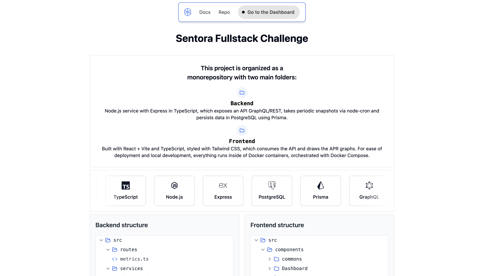
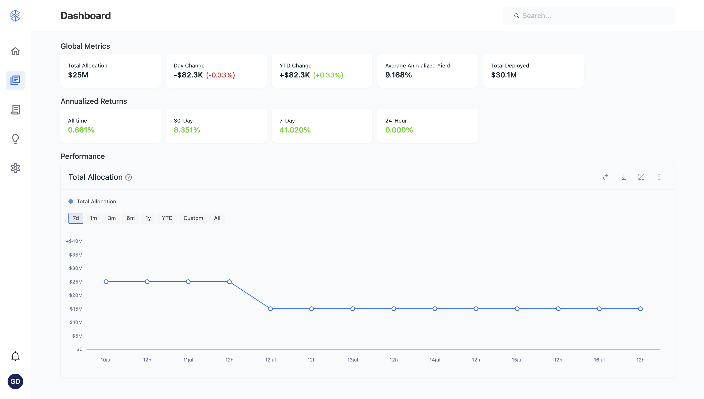
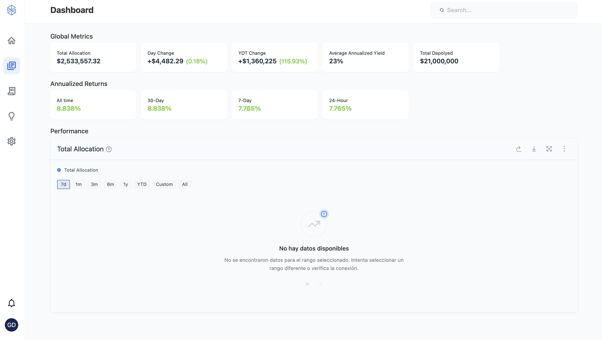
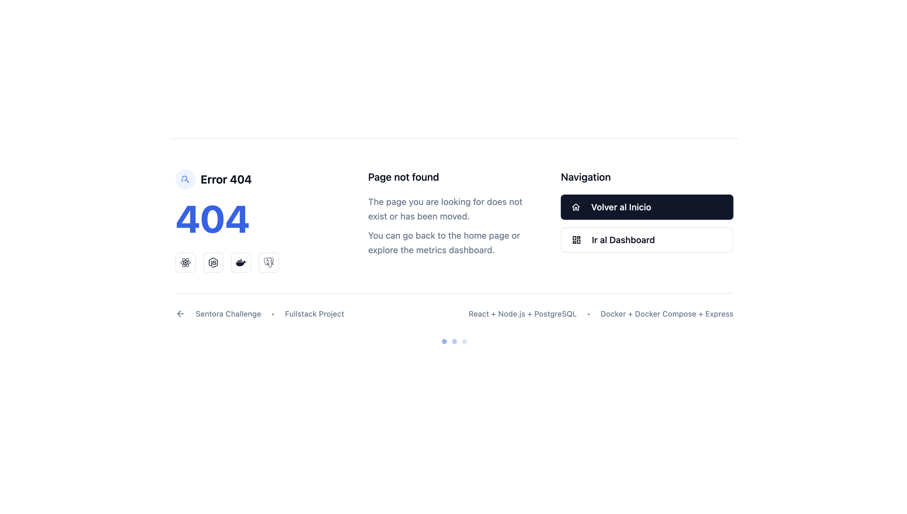
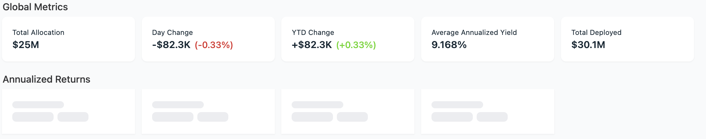

# Sentora FullStack exercise - German Derbes Catoni 

Dashboard AMM para monitoreo de liquidez y APR de pares Uniswap v2 con datos en tiempo real de The Graph.

## Inicio

### capturas

## Home
<p align="center">
  
</p>

## Dashboard con skeletons de carga y empty state
<p align="center">
  
</p>
<p align="center">
  
</p>

## Not found page
<p align="center">
  
</p>

## Global Metrics y Annualized Returns con data dinamica, skeletons y empty state
<p align="center">
  
</p>
<p align="center">
  
</p>


### Prerequisitos
- Docker y Docker Compose instalados
- Puertos 3001 (backend) y 5173 (frontend) disponibles

###  **Comando para levantar todo:**

```bash
# Clonar el repositorio
git clone <url>
cd sentora

cd backend && ./scripts/start.sh
```

Este comando:
- ✅ Levanta PostgreSQL + Backend automáticamente
- ✅ Configura base de datos con migraciones
- ✅ Inicia captura de datos de The Graph
- ✅ Verifica que todo funcione
- ✅ Muestra endpoints para testing

### 🖥️ **Frontend (en nueva terminal):**

```bash
# Mientras el backend arranca, en otra terminal:
cd frontend
npm install
npm run dev
# Frontend disponible en http://localhost:5173
```

### 🔍 **Verificar que todo funciona:**

```bash
# ✅ Backend health check
curl http://localhost:3001/api/health

# ✅ Ver datos capturados
curl http://localhost:3001/api/metrics/snapshots
```

---

## 📊 Stack Tecnológico

### Backend
- **Node.js + TypeScript + Express** - API REST
- **PostgreSQL + Prisma ORM** - Base de datos y migrations
- **GraphQL (The Graph)** - Datos DeFi en tiempo real
- **Docker + Docker Compose** - Orquestación completa
- **Redis** - Cache y almacenamiento temporal
- **Cron Jobs (node-cron)** - Captura automática de snapshots
- **Zod** - Validación de schemas y tipos
- **CORS** - Habilitación de cross-origin requests
- **ESLint + Prettier** - Linting y formateo de código

### Frontend
- **React + TypeScript** - Interfaz moderna
- **TailwindCSS** - Estilos responsive y utilidades CSS
- **Recharts** - Visualización de datos y gráficos interactivos
- **React Query (TanStack Query)** - Gestión de estado servidor
- **Shadcn/ui** - Componentes consistentes y accesibles
- **Framer Motion** - Animaciones fluidas y interacciones
- **React Router** - Navegación entre páginas
- **React Icons** - Iconografía consistente
- **Vite** - Build tool moderno y rápido
- **ESLint + Prettier** - Linting y formateo de código

---

## 🏗️ Arquitectura

```
┌─────────────────┐    GraphQL    ┌──────────────┐
│   The Graph     │◄─────────────┤   Backend    │
│   (Uniswap v2)  │               │   Node.js    │
└─────────────────┘               │              │
                                  │  ┌────────┐  │
                ┌─────────────────┤  │ Cron   │  │
                │                 │  │ Jobs   │  │
                │                 │  └────────┘  │
                │                 └──────────────┘
                │                        │
                │                        │ REST API
                │                        ▼
    ┌───────────▼────────┐     ┌─────────────────┐
    │   PostgreSQL       │     │    Frontend     │
    │   (Snapshots)      │     │    React        │
    └────────────────────┘     │                 │
                               │  ┌──────────┐   │
                               │  │ Charts   │   │
                               │  │ Filters  │   │
                               │  │ APR Calc │   │
                               │  └──────────┘   │
                               └─────────────────┘
```

---

## 🛠️ Herramientas de Desarrollo

### **Calidad de Código**
- **TypeScript** - Tipado estático para mayor robustez
- **Husky** - Git hooks para pre-commit
- **Lint-staged** - Linting solo en archivos modificados
- **Prettier** - Formateo automático de código
- **ESLint** - Análisis estático y detección de errores

### **Testing**
- **Vitest** - Testing framework moderno
- **React Testing Library** - Testing de componentes
- **MSW** - Mocking de APIs para testing

### **Desarrollo**
- **Vite** - Build tool rápido con HMR
- **React DevTools** - Debugging de componentes
- **Postman/Insomnia** - Testing de APIs

### **Hooks Personalizados**
- **useGetChartData** - Datos para gráficos con cache
- **useGetGlobalMetrics** - Métricas globales del dashboard
- **useGetAnnualizedReturns** - Retornos anualizados por período

> **Nota**: Se han eliminado hooks no utilizados (useGetSnapshots, useGetPairs, useGetPairAPR, useGetAllPairsAPR, useMetricsCache) para mantener el código limpio y optimizado.

---

## 📈 Funcionalidades Principales

### ⚡ **Tiempo Real**
- Captura automática de datos cada 60 minutos
- Snapshots de liquidez, volumen y fees
- Cálculo automático de APR

### 📊 **Dashboard Interactivo**
- Gráficos responsivos con Recharts
- Filtros temporales: 7d, 1m, 3m, 6m, 1y, YTD, Custom, All
- Date picker para rangos personalizados
- Tooltips con información detallada

### 🎯 **Métricas Avanzadas**
- APR calculado con moving averages
- Visualización de gaps en datos faltantes
- Escalas Y uniformes y optimizadas
- Formateo inteligente de fechas

### 🎨 **Animaciones y UX**
- **Framer Motion** - Transiciones fluidas y micro-interacciones
- **Hover Effects** - Efectos sutiles en cards y botones
- **Loading States** - Skeletons animados durante carga
- **Error States** - Estados de error con animaciones
- **Page Transitions** - Transiciones entre páginas
- **Responsive Design** - Adaptación a todos los dispositivos

---

## 🗂️ Estructura del Proyecto

```
sentora/
├── backend/              # Node.js + Express API
│   ├── src/
│   │   ├── routes/       # Endpoints REST
│   │   ├── services/     # Lógica de negocio
│   │   ├── graphql/      # Cliente The Graph
│   │   └── types/        # TypeScript types
│   ├── prisma/           # Schema + migraciones
│   ├── scripts/
│   │   └── start.sh      # 🎯 Setup automático
│   └── docker-compose.yml
├── frontend/             # React + TypeScript
│   ├── src/
│   │   ├── components/   # UI components
│   │   ├── hooks/        # Custom hooks
│   │   └── pages/        # Páginas
│   └── package.json
└── README.md            # 📖 Este archivo
```

---

## 🔧 Comandos de Desarrollo

### Backend
```bash
cd backend

# 🚀 Inicio completo (recomendado)
./scripts/start.sh

# 🛠️ Solo desarrollo local
npm run dev

# 📊 Ver logs en tiempo real
docker logs -f sentora-backend

# 🗄️ Acceso directo a PostgreSQL
docker exec -it sentora-postgres psql -U sentora_user -d sentora_db

# 🧹 Limpiar y resetear todo
docker compose down -v
```

### Frontend
```bash
cd frontend

# Desarrollo
npm run dev

# Build para producción
npm run build

# 🧪 Testing
npm test              # modo wathc
npm run test:run      # Ejecutar todos los tests
npm run test:ui       # Interfaz gráfica de tests
```

---

## 🧪 Testing

### Stack de Testing
- **Vitest** 
- **React Testing Library** - testing de componentes React
- **jsdom** - dom virtual para testing
- **@vitest/ui** - interfaz gráfica para tests

### Comandos de Testing
```bash
cd frontend

# Ejecutar todos los tests
npm test

# Ejecutar tests una sola vez
npm run test:run

# Interfaz gráfica de tests (navegador)
npm run test:ui

# Reporte de cobertura
npm run coverage  # Requiere: npm install --save-dev @vitest/coverage-v8
```

### Estructura de Tests
```
src/
├── App.test.tsx                                    # Test principal de la app
├── components/
│   ├── commons/SectionTitle/SectionTitle.test.tsx # Tests de componentes comunes
│   └── Dashboard/MetricsCard/MetricsCard.test.tsx # Tests de componentes dashboard
└── test/
    └── setup.ts                                   # Configuración global de tests
```

### Mocks Configurados
- **IntersectionObserver** - Para componentes con framer-motion
- **ResizeObserver** - Para componentes responsivos
- **matchMedia** - Para tests de media queries
- **requestAnimationFrame** - Para animaciones

### Escribir Tests
```typescript
import { render, screen } from "@testing-library/react";
import { describe, it, expect } from "vitest";

describe("MiComponente", () => {
  it("renders correctly", () => {
    render(<MiComponente />);
    expect(screen.getByText("Expected Text")).toBeInTheDocument();
  });
});
```

---

## API Endpoints Disponibles

### 🔍 **Health & Status**
- `GET /api/health` - Estado del servicio
- `GET /api/db-check` - Verificar base de datos
- `GET /` - Información general

### 📊 **Métricas Core (Utilizados por Frontend)**
- `GET /api/metrics/global` - Métricas globales del dashboard
- `GET /api/metrics/annualized-returns` - Retornos anualizados por período
- `GET /api/metrics/chart?timeRange=7d` - Datos para gráficos
- `GET /api/metrics/chart?timeRange=custom&from=2025-07-01&to=2025-07-05` - Rango personalizado

### 📊 **Métricas Adicionales**
- `GET /api/metrics/snapshots` - Todos los snapshots
- `GET /api/metrics/snapshots?pairAddress=0x...` - Por par específico
- `GET /api/metrics/pairs` - Pares monitoreados
- `GET /api/metrics/apr` - Cálculo APR con moving averages
- `GET /api/metrics/apr/all` - APR para todos los pares

---


### **Endpoints para Insomnia/Postman**

```http
### Health Check
GET http://localhost:3001/api/health

### Ver Snapshots Recientes
GET http://localhost:3001/api/metrics/snapshots

### Datos para Chart (7 días)
GET http://localhost:3001/api/metrics/chart?timeRange=7d

### Datos Custom Range
GET http://localhost:3001/api/metrics/chart?timeRange=custom&from=2025-07-02&to=2025-07-08

### Pares Monitoreados
GET http://localhost:3001/api/metrics/pairs
```
---

## Contacto

**German Derbes Catoni**
- 📧 Email: germanderbescatoni@gmail.com
- 🐙 GitHub: [https://github.com/GDC94]

---